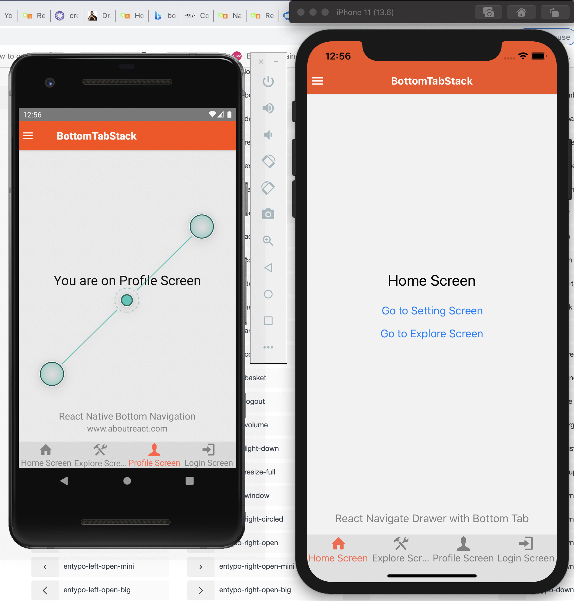
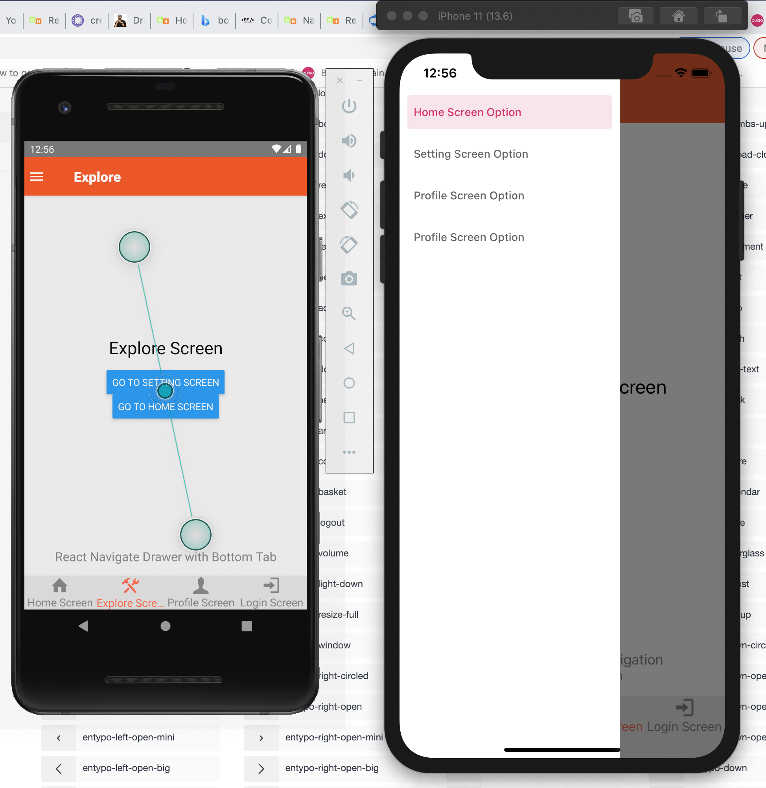
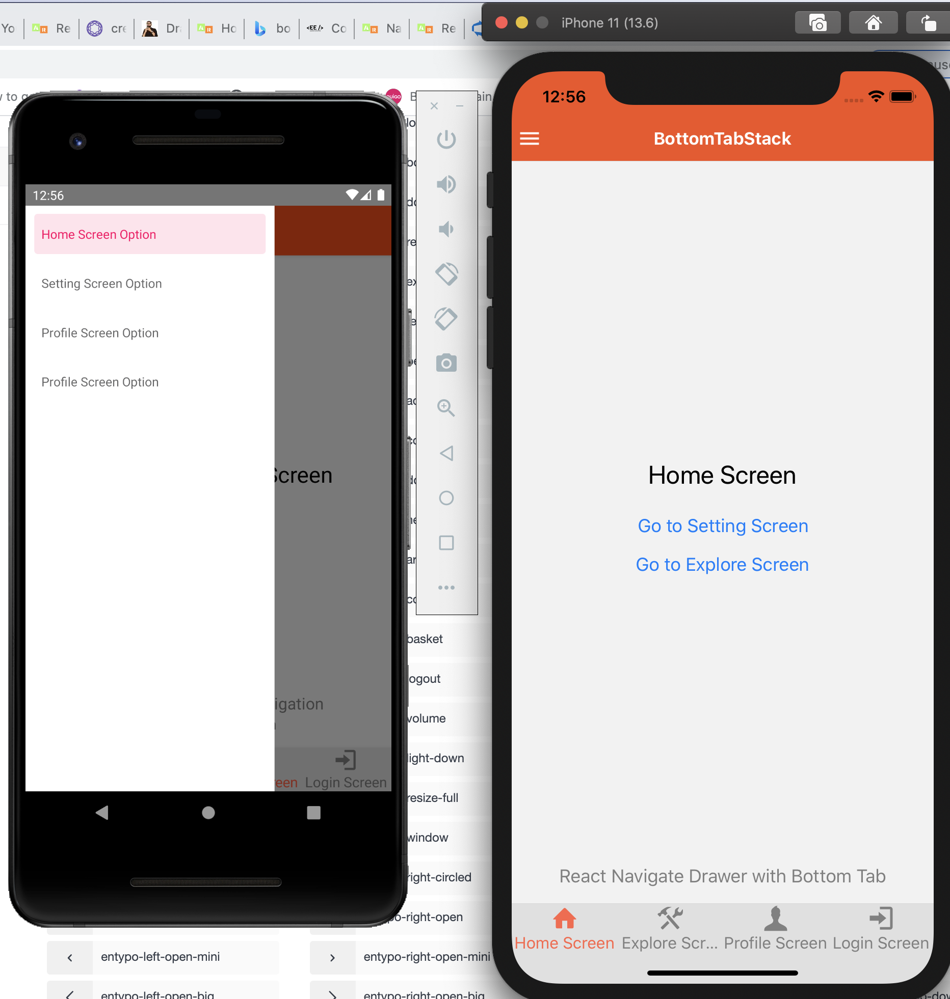
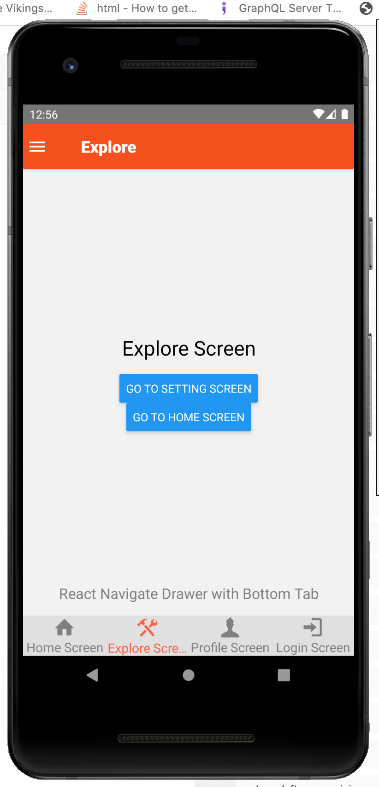

React-Native-Templates-New
Templates for react native using react native v5 and vector icons. This has 3 templates that includes DrawerNavigator, TabBarNavigator and TopNavigator. It also includes vector icons as well as some custom fonts. If you are wishing to use only one navigator then remove all other dependencies by running following commands

# To Create a Drawer Navigator

<NavigationContainer>
  <Drawer.Navigator
    drawerContentOptions={{
      activeTintColor: '#e91e63',
      itemStyle: { marginVertical: 5 },
    }}>
    <Drawer.Screen
      name="HomeScreenStack"
      options={{ drawerLabel: 'Home Screen Option' }}
      component={HomeScreenStack} />
    <Drawer.Screen
      name="SettingScreenStack"
      options={{ drawerLabel: 'Setting Screen Option' }}
      component={SettingScreenStack} />
  </Drawer.Navigator>
</NavigationContainer>

# To Create Bottom Tab Navigator

<Tab.Navigator
  initialRouteName="HomeScreen"
  tabBarOptions={{
    activeTintColor: 'tomato',
    inactiveTintColor: 'gray',
    style: {
      backgroundColor: '#e0e0e0',
    },
    labelStyle: {
      textAlign: 'center',
      fontSize: 16
    },
  }}>
  <Tab.Screen
    name="HomeScreen"
    component={HomeScreen}
    options={{
    }}  />
  <Tab.Screen
    name="ExploreScreen"
    component={ExploreScreen}
    options={{
    }} />
</Tab.Navigator>

# Screen Shots

